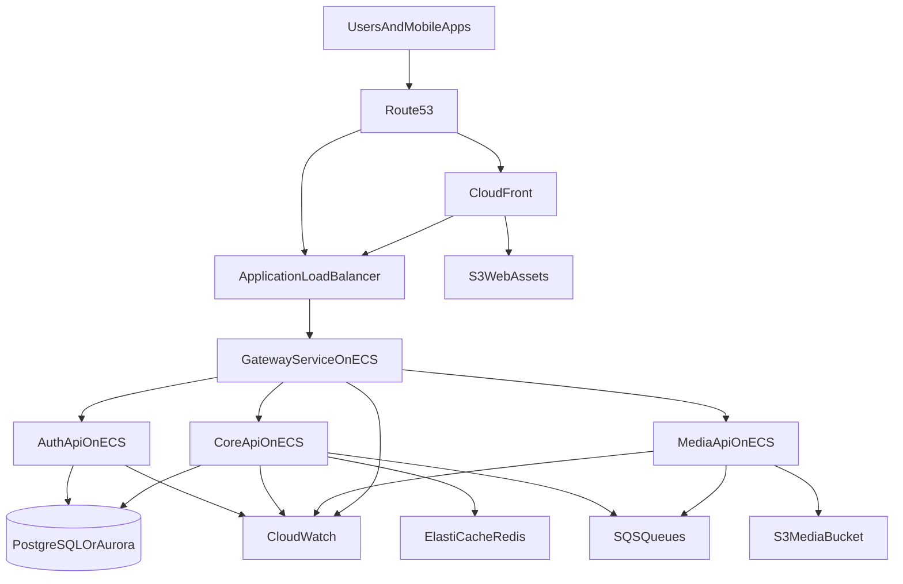

# IPSSA AWS Architecture

## Purpose
This document defines a target AWS architecture for the IPSSA platform that is:

- redundant
- scalable
- fault tolerant
- secure
- operationally realistic for a small team

It also explains how the platform can start as a proof of concept on Railway and/or Vercel, then graduate to AWS without a major architectural rewrite.

This document is aligned with the current repository structure and product direction:

- native iOS app
- native Android app
- limited web frontend for marketing, BD, and selected member workflows
- backend services under `codebase/apis/`

---

## Architecture Goals

### Business goals
- Keep CoverageMatch and core member workflows available during partial infrastructure failures
- Protect proof-of-service data, ratings, and chapter communications
- Support gradual growth from pilot chapters to a broader member base
- Minimize architectural churn between proof of concept and production

### Technical goals
- No single point of failure at the compute, database, or network edge layers
- Multi-AZ deployment for production workloads
- Horizontal scaling at the API and web edge layers
- Durable object storage for media and proof photos
- Clear separation between public edge, private compute, and private data
- Strong observability, backup, and incident recovery posture

---

## Recommended Hosting Progression

## Phase 0: Proof of Concept

### Suggested PoC hosting
- `codebase/uis/frontend/`: Vercel
- `codebase/apis/`: Railway or Render-style container hosting
- media: S3 can still be used even during PoC to avoid later migration pain
- database: managed PostgreSQL, ideally in AWS if practical

### Why this is acceptable
- Faster time to first demo
- Minimal DevOps overhead
- Easy preview deployments
- Good fit for pilot-stage experimentation

### PoC guardrails
To make migration easier later, even the PoC should adopt these patterns:

- keep services separated logically:
  - gateway
  - auth-api
  - core-api
  - media-api
- use PostgreSQL from the beginning
- use S3-compatible storage semantics for uploads
- keep secrets out of source control
- keep environment-specific config externalized
- use structured logs and request IDs from the start

---

## Phase 1: AWS Production Target

### Recommended AWS stack
- `Route 53` for DNS
- `AWS WAF` for edge protection
- `CloudFront` for global caching and TLS termination for static web assets
- `Application Load Balancer (ALB)` for HTTP routing to backend services
- `Amazon ECS on Fargate` for containerized backend services
- `Amazon ECR` for container image storage
- `Amazon RDS for PostgreSQL` or `Amazon Aurora PostgreSQL` for relational data
- `Amazon S3` for proof photos, uploads, and static assets
- `Amazon ElastiCache for Redis` for caching, transient coordination, and optional rate-limiting/session helpers
- `Amazon SQS` for asynchronous workflows
- `CloudWatch` for logs, metrics, and alarms
- `AWS X-Ray` or OpenTelemetry-compatible tracing pipeline for request tracing
- `AWS Secrets Manager` for application secrets
- `AWS Systems Manager Parameter Store` for non-secret configuration
- `AWS KMS` for encryption key management
- `AWS Certificate Manager (ACM)` for TLS certificates
- `IAM` for least-privilege service roles

### Why ECS Fargate is the recommended default
For this platform, `ECS Fargate` is the strongest default over EC2-managed ECS or EKS because:

- lower operational burden than Kubernetes
- strong fit for a small-to-mid-sized platform team
- easy horizontal scaling for Node/Express services
- integrates cleanly with ALB, CloudWatch, Secrets Manager, and ECR
- no server fleet to patch for the application tier

If the platform later grows into a large multi-team estate with advanced platform engineering requirements, EKS can be reconsidered. It is not the recommended first production target.

---

## High-Level AWS Topology

---

## Network Design

## VPC layout
Use one VPC per environment, at minimum:

- `staging`
- `production`

Development may run locally or in a shared lower-cost AWS environment, but production should be isolated.

### Production VPC design
Deploy across **three Availability Zones** where region support and cost allow.

Per AZ:
- 1 public subnet
- 1 private application subnet
- 1 private data subnet

### Public subnets
Host:
- ALB
- NAT Gateways

### Private application subnets
Host:
- ECS Fargate tasks for:
  - gateway
  - auth-api
  - core-api
  - media-api
- background worker tasks if split later

### Private data subnets
Host:
- RDS / Aurora
- ElastiCache Redis

### Networking principles
- backend services should not be publicly reachable directly
- only ALB should be public
- databases and caches remain in private subnets
- security groups should explicitly restrict east-west traffic
- VPC endpoints should be considered for:
  - S3
  - ECR
  - CloudWatch Logs
  - Secrets Manager
  - SQS

This improves security and can reduce NAT traffic costs.

---

## Compute Layer

## Services on ECS Fargate

### 1. Gateway service
Responsibilities:
- route requests
- validate auth at the edge
- normalize errors
- apply rate limiting and request policies

Deployment:
- at least 2 tasks across multiple AZs in production
- fronted by ALB target group
- stateless

Scaling:
- CPU and memory based autoscaling
- optional request-count-based scaling from ALB metrics

### 2. Auth API
Responsibilities:
- identity lifecycle
- login/session/token issuance
- password reset
- verification
- authorization claims

Deployment:
- at least 2 tasks across multiple AZs
- private subnets only
- stateless aside from backing data stores

Scaling:
- CPU and latency based autoscaling

### 3. Core API
Responsibilities:
- chapters
- profiles
- CoverageMatch
- ratings
- community
- Prep Lab
- notification orchestration

Deployment:
- at least 2 tasks across multiple AZs
- likely the highest-volume backend service

Scaling:
- scale independently from auth and media
- CPU, memory, and request latency driven scaling

### 4. Media API
Responsibilities:
- upload authorization
- metadata management
- signed URL generation
- retention/deletion workflows

Deployment:
- at least 2 tasks across multiple AZs
- private subnets only

Scaling:
- scale on request volume and memory
- keep uploads direct-to-S3 when possible to reduce service load

---

## Load Balancing and Traffic Routing

## Public entry points

### CloudFront
Recommended uses:
- static marketing site delivery
- CDN for frontend assets
- optional caching/proxy layer in front of selected API traffic if later justified

### Application Load Balancer
Recommended uses:
- route HTTPS traffic to ECS services
- path-based or host-based routing to the gateway
- health checks for service targets
- TLS termination via ACM

### Route strategy
Recommended domain model:
- `www.example.com` -> CloudFront -> static web
- `app.example.com` -> ALB -> gateway -> APIs
- optional:
  - `api.example.com` -> ALB -> gateway

For mobile apps, API traffic should target the gateway/ALB endpoint, not individual services.

---

## Data Layer

## Primary relational database

### Recommended choice
Default recommendation: **Amazon Aurora PostgreSQL** for production.

Why:
- better resilience and scaling options than plain single-instance PostgreSQL
- managed backups and failover
- strong PostgreSQL compatibility
- read replicas available as the system grows

If cost sensitivity is more important than scale in early production:
- begin with `RDS PostgreSQL Multi-AZ`
- migrate to Aurora PostgreSQL when justified

### Database design recommendation
Use one cluster with clear separation:
- separate databases or strict schema boundaries for:
  - auth
  - core
  - media metadata

Do **not** give every service unrestricted access to all schemas.

### Redundancy
- Multi-AZ enabled
- automated backups enabled
- point-in-time recovery enabled
- regular restore testing required

### Read scaling
Not required on day one, but the architecture should allow:
- read replica(s) for heavy read paths
- future reporting or analytics workloads to offload from primary traffic

---

## Object Storage

## S3 buckets
Recommended separate buckets or prefixes for:
- web static assets
- proof photos and dossier uploads
- profile assets
- logs/exports if needed later

### S3 best practices
- versioning enabled for critical buckets
- server-side encryption enabled
- lifecycle rules for archival/deletion
- strict bucket policies
- direct client uploads via pre-signed URLs where appropriate

### Media fault tolerance
S3 is already multi-AZ by design within a region, making it a strong fit for:
- proof-of-service photos
- profile images
- exported assets

For disaster recovery later:
- optional cross-region replication for critical media buckets

---

## Caching, Queues, and Async Processing

## ElastiCache Redis
Use Redis for:
- short-lived cache entries
- hot lookup acceleration
- optional rate-limiting support
- optional coordination primitives where needed

Do not make Redis the source of truth for critical business records.

Deploy:
- Multi-AZ replication group
- automatic failover enabled

## SQS
Use SQS for:
- notification fan-out jobs
- score recalculation jobs
- media cleanup jobs
- background moderation or indexing tasks

Benefits:
- decouples user-facing APIs from slow async processing
- improves resilience under burst traffic
- simplifies retry handling

If the workload grows, worker services can run as separate ECS tasks.

---

## Frontend and Client Delivery on AWS

## Web frontend
Given the current scope, the web experience is mostly:
- marketing
- BD/contact flows
- limited member portal

### Recommended AWS approach
If primarily static or SPA:
- build artifacts stored in S3
- served via CloudFront

If later server-rendered features are required:
- host a separate web service on ECS behind the ALB

### Recommendation
Start with:
- static hosting via S3 + CloudFront
- dynamic member portal API calls to gateway

This keeps cost and complexity low.

## Mobile apps
iOS and Android binaries are not hosted like web apps, but AWS supports the runtime needs:
- APIs behind ALB/gateway
- S3 for direct uploads/downloads
- Cognito is optional, but not required if custom Auth API remains the plan
- push notification integration remains via APNs and FCM, orchestrated by backend services

---

## Security Architecture

## Edge security
- AWS WAF in front of CloudFront and/or ALB
- TLS everywhere with ACM
- strict CORS policy at gateway
- route-class rate limiting

## Service security
- IAM task roles per ECS service
- Secrets Manager for secrets
- Parameter Store for non-secret config
- KMS-backed encryption
- least privilege between services

## Data security
- encrypted RDS/Aurora storage
- encrypted Redis where supported/appropriate
- encrypted S3 buckets
- pre-signed URLs for private media access

## Application security
- auth enforcement centralized at gateway plus service-level authorization checks
- audit logs for:
  - auth events
  - rating disputes
  - moderation actions
  - coverage actions
  - media deletion/access-sensitive events

---

## Redundancy and Fault Tolerance

## Availability Zone strategy
Production should run across at least **two AZs**, preferably **three AZs**.

This applies to:
- ALB
- ECS tasks
- RDS/Aurora failover topology
- Redis failover topology

## Compute fault tolerance
- multiple ECS tasks per service
- tasks spread across AZs
- ALB health checks remove unhealthy tasks automatically
- autoscaling replenishes healthy capacity

## Database fault tolerance
- Multi-AZ database deployment
- automatic failover
- tested backup restore procedures

## Storage fault tolerance
- S3 for durable multi-AZ object storage
- lifecycle and replication policies for critical assets

## Queue fault tolerance
- SQS provides durable async buffering
- worker retries and dead-letter queues should be configured

## Deployment fault tolerance
- rolling deployments or blue/green where justified
- health checks must gate traffic shift
- one service failure should not cascade across all services

---

## Scalability Strategy

## Horizontal scaling
The following components should scale horizontally:
- gateway
- auth-api
- core-api
- media-api

### Scaling signals
- CPU utilization
- memory utilization
- request latency
- ALB request count
- SQS queue depth for worker services

## Vertical scaling
Primarily for:
- database tier
- Redis tier

Vertical scaling is acceptable early, but application services should remain stateless and horizontally scalable.

## Expected scale path

### Early production
- 2 tasks per API service
- single ALB
- Aurora/RDS Multi-AZ
- Redis Multi-AZ
- S3 for media

### Growth stage
- more ECS tasks
- reader endpoints / replicas for DB
- separate worker services
- stronger caching for hot reads
- additional WAF rules and operational tooling

---

## Disaster Recovery and Backups

## Backup strategy
- automated database backups
- point-in-time recovery
- S3 versioning for critical buckets
- infrastructure as code for reproducible environments

## Disaster recovery posture

### Regional failure
Day-one full active-active multi-region is likely excessive.

Recommended progression:

#### Stage 1
- single-region, multi-AZ production
- documented restore/rebuild process

#### Stage 2
- cross-region backups
- optional S3 replication
- optional warm standby patterns for critical systems

#### Stage 3
- evaluate active-passive multi-region DR if business requirements justify it

## Recovery targets
Initial recommended targets:
- `RPO`: 15 minutes or better
- `RTO`: 1-4 hours for severe incidents in early production

These should be tightened only if the business cost of downtime justifies the added spend and complexity.

---

## Environments

Recommended environments:
- `local`
- `dev`
- `staging`
- `production`

### Staging
Should mirror production architecture as closely as budget allows:
- same service boundaries
- same deployment model
- smaller scale
- separate data

Do not validate production failover or deployment safety only in local environments.

---

## Observability and Operations

## Logging
- structured JSON logs
- correlation IDs propagated from gateway through all services

## Metrics
- request rate
- error rate
- latency
- queue depth
- upload failure rate
- match success rate
- notification delivery success

## Alarms
At minimum:
- ALB 5xx rate
- ECS unhealthy task count
- database CPU/storage/connection pressure
- Redis failover or memory pressure
- SQS dead-letter queue growth
- upload/signing failures

## Dashboards
Recommended dashboards:
- platform health
- auth health
- CoverageMatch health
- media pipeline health
- business KPIs

---

## Infrastructure as Code

This AWS stack should be managed as code from the beginning of AWS migration.

Recommended options:
- Terraform
- AWS CDK

Either is viable. The key requirement is:
- reproducible environments
- versioned infrastructure changes
- reviewable diffs
- no manual production drift

---

## AWS Service-by-Service Recommendation

| Concern | Recommended AWS service | Notes |
|---|---|---|
| DNS | Route 53 | Production domain routing |
| CDN / static delivery | CloudFront | Web assets and edge caching |
| Static web hosting | S3 | Good fit for React/Vite site |
| Edge protection | WAF | Add bot and abuse protections |
| TLS certificates | ACM | Use with CloudFront and ALB |
| Public HTTP entry | ALB | Route to ECS services |
| Container runtime | ECS Fargate | Best default for small team ops |
| Image registry | ECR | Container image storage |
| Relational data | Aurora PostgreSQL | Strong production default |
| Lower-cost DB option | RDS PostgreSQL Multi-AZ | Valid early production step |
| Object storage | S3 | Media, proof photos, static assets |
| Cache | ElastiCache Redis | Cache and coordination helpers |
| Async jobs | SQS | Durable queueing |
| Secrets | Secrets Manager | Sensitive config |
| Config | Parameter Store | Non-secret config |
| Encryption | KMS | Key management |
| Metrics/logs | CloudWatch | Operational baseline |

---

## Recommended Production Blueprint

## Small-team recommended production baseline

### Web
- S3 + CloudFront

### APIs
- ECS Fargate services:
  - gateway
  - auth-api
  - core-api
  - media-api

### Data
- Aurora PostgreSQL Multi-AZ
- ElastiCache Redis Multi-AZ
- S3 buckets for media and static assets

### Networking
- 1 VPC
- 3 AZs
- public, private-app, and private-data subnets
- ALB in public subnets

### Security
- WAF
- ACM
- Secrets Manager
- IAM task roles
- KMS encryption

### Operations
- CloudWatch logs and alarms
- SQS-based background processing
- infrastructure as code

This is the most balanced design for resilience, cost, and team complexity.

---

## Migration Path from PoC to AWS

## Step 1
Run:
- web on Vercel
- APIs on Railway
- media on S3 if possible
- PostgreSQL in a managed service with PostgreSQL compatibility

## Step 2
Move backend first:
- containerize gateway/auth/core/media
- deploy to ECS Fargate
- introduce ALB and Route 53
- move secrets/config into AWS-managed stores

## Step 3
Move web:
- deploy web build to S3 + CloudFront
- keep API endpoint stable through Route 53

## Step 4
Add resilience:
- Multi-AZ database
- Redis failover
- SQS workers
- alarms and dashboards

## Step 5
Harden:
- WAF
- backup/restore drills
- disaster recovery runbooks
- optional cross-region protection

---

## Non-Goals for Initial AWS Rollout

These are probably too heavy for the first production cut:
- full Kubernetes/EKS platform
- active-active multi-region
- service mesh
- event-driven rewrite of the entire platform
- separate data warehouse/analytics platform

They may become justified later, but they should not block the first stable AWS deployment.

---

## Final Recommendation

For this platform, the best target architecture is:

- **CloudFront + S3** for the web layer
- **ALB + ECS Fargate** for backend services
- **Aurora PostgreSQL** for primary relational data
- **S3** for media and proof-of-service assets
- **ElastiCache Redis** for caching and transient coordination
- **SQS** for background jobs
- **Route 53 + ACM + WAF** for secure and resilient public entry
- **CloudWatch + IaC + Secrets Manager** for operations and governance

This design is:
- highly available within a region
- fault tolerant across Availability Zones
- horizontally scalable at the API layer
- realistic for a small team to run
- compatible with a fast PoC phase before full AWS migration
