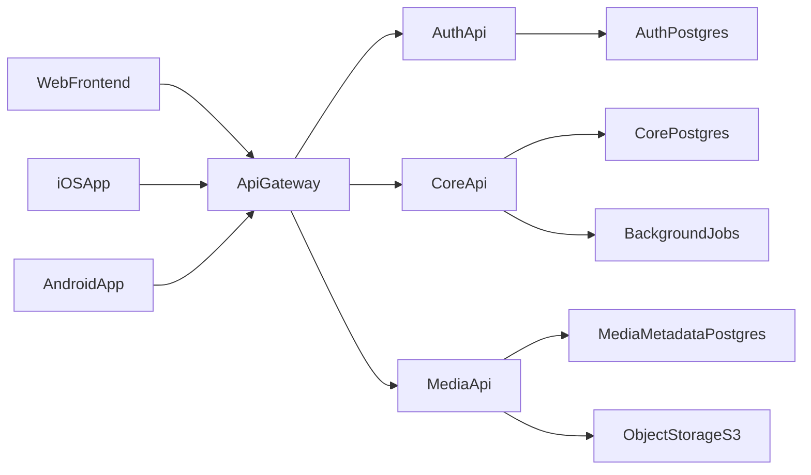
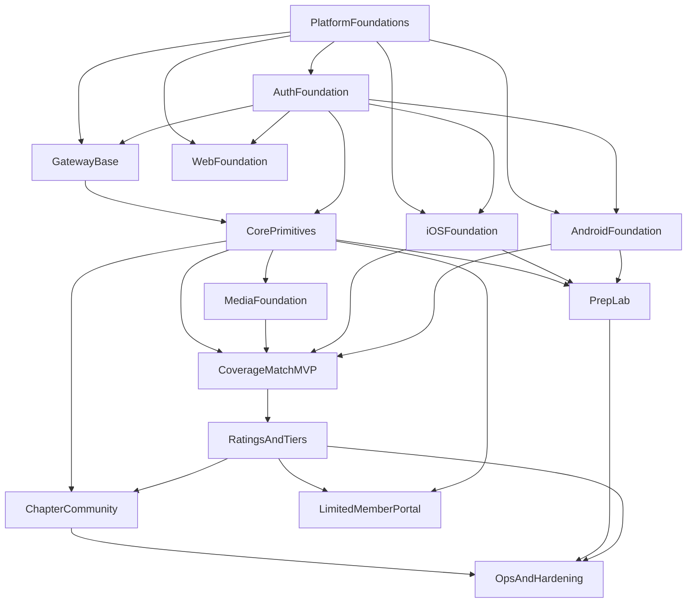
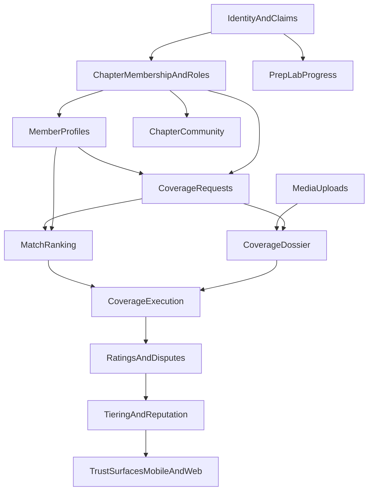

# IPSSA Implementation Stories Backlog

## Purpose
This document translates the product brief in `/Users/sandyfriedman/___products/ipssa/docs/product/IPSSA_Mobile_App_Opportunity.md` into a build-ready implementation backlog. It is intended to be the engineering source of truth for how the platform should be built, in what order, and by which component owners.

This document is intentionally code-free. It defines:

- titles
- descriptions
- use cases
- acceptance criteria
- complexity
- dependencies
- delivery waves

## Scope Assumptions
- Product shape is now **native-mobile-first**
- Client surfaces:
  - `codebase/uis/ios/`: native iOS app, primary member experience
  - `codebase/uis/android/`: native Android app, primary member experience
  - `codebase/uis/frontend/`: React + TypeScript + Tailwind website for marketing, BD/lead capture, and a limited member portal
- Backend surfaces:
  - `codebase/apis/`: container directory for all backend services
  - `codebase/apis/gateway/`: API gateway routing, auth enforcement, edge controls
  - `codebase/apis/auth-api/`: authentication and authorization
  - `codebase/apis/core-api/`: business domains and product rules
  - `codebase/apis/media-api/`: proof photos, uploads, media access, lifecycle
- Backend implementation stack:
  - Node.js latest stable LTS at implementation kickoff
  - Express latest stable major
  - TypeScript latest stable major
- Web implementation stack:
  - React latest stable major
  - Tailwind latest stable major
  - Vite or equivalent secure modern bundler/dev server
- Mobile implementation assumptions:
  - `codebase/uis/ios/` project is created first in Xcode and then integrated into the repo
  - `codebase/uis/android/` project is created first in Android Studio and then integrated into the repo
  - recommend Swift/SwiftUI for iOS and Kotlin/Jetpack Compose for Android unless later overridden
- Dependency policy:
  - use current stable libraries at kickoff
  - enable dependency scanning and regular update cadence

## Repository Structure Target
The workspace should be structured as:

- `codebase/`
  - `uis/`
    - `frontend/`
    - `ios/`
    - `android/`
  - `apis/`
    - `gateway/`
    - `auth-api/`
    - `core-api/`
    - `media-api/`

The `codebase/uis/ios/` and `codebase/uis/android/` directories may begin empty until the native projects are created in Xcode and Android Studio.

## Complexity Scale
- `S`: isolated implementation, low domain risk, usually 1-3 days
- `M`: moderate scope, 3-7 days, some cross-team coordination
- `L`: broad scope, multi-step domain work, likely 1-3 weeks
- `XL`: cross-service or multi-client capability with substantial rollout/testing

## Component Responsibilities

| Component | Primary responsibility |
|---|---|
| `codebase/uis/frontend/` | Marketing site, BD/contact flows, limited member portal |
| `codebase/uis/ios/` | Primary iOS member app workflows |
| `codebase/uis/android/` | Primary Android member app workflows |
| `codebase/apis/gateway/` | Single entry point, route dispatching, auth propagation, edge controls |
| `codebase/apis/auth-api/` | Accounts, sessions/tokens, password reset, verification, claims |
| `codebase/apis/core-api/` | Chapters, roles, profiles, CoverageMatch, dossiers, ratings, community, Prep Lab |
| `codebase/apis/media-api/` | Upload authorization, object validation, metadata, access URLs, retention |

## System Map

## Global Dependency Graph

## Capability Dependency Graph

## Delivery Philosophy
- Full-platform backlog
- MVP-first sequencing
- Native mobile is the primary product experience
- Web is intentionally narrower: marketing, BD, lead capture, and limited member capabilities
- Backend foundations must stabilize before mobile workflows are built deeply
- Service ownership is explicit to reduce rework

---

# Epic A: Platform Foundations

## PF-01 Monorepo and Workspace Foundations
- **Primary service owner:** Platform
- **Title:** Establish monorepo, folder structure, and shared engineering standards
- **Description:** Create the repository structure for `codebase/` (containing `uis/` with `frontend`, `ios`, and `android`, plus `apis/` with `gateway`, `auth-api`, `core-api`, and `media-api`), along with shared tooling, workspace config, TypeScript standards, and common scripts.
- **Use cases:**
  - Engineer clones repo and runs all services locally
  - Native iOS and Android projects have reserved directories before project bootstrap
  - Shared TypeScript standards apply consistently across services
  - Teams can add packages without fragmenting tooling
- **Acceptance criteria:**
  - Repository layout supports `codebase/uis/` for web and native clients, and `codebase/apis/` for backend services
  - Empty `codebase/uis/frontend/`, `codebase/uis/ios/`, and `codebase/uis/android/` directories are present if native projects have not yet been created
  - `codebase/apis/` exists as the backend container directory
  - Shared workspace/package manager strategy is documented
  - Shared lint, format, and TypeScript configuration approach is defined
  - Local bootstrap instructions exist for all services
  - Dependency update/scanning policy is documented
- **Complexity:** `M`
- **Dependencies:** None

## PF-02 Environment, Secret, and Configuration Strategy
- **Primary service owner:** Platform
- **Title:** Define runtime configuration and secret management model
- **Description:** Establish environment separation, secret injection, service discovery conventions, and config validation standards for local, staging, and production.
- **Use cases:**
  - Developers run services locally without production secrets
  - Native apps point to local/staging backends safely
  - Deployments fail fast if required config is missing
  - Services can discover each other consistently through the gateway
- **Acceptance criteria:**
  - Environment variable ownership is defined per service
  - Mobile configuration strategy is documented for iOS and Android environment targets
  - Secret sources and non-secret config are separated
  - Config validation strategy is defined for startup
  - Local, staging, and production environments are documented
- **Complexity:** `S`
- **Dependencies:** `PF-01`

## PF-03 CI, Quality Gates, and Dependency Hygiene
- **Primary service owner:** Platform
- **Title:** Add CI baseline and dependency security controls
- **Description:** Define the CI pipeline and quality checks that protect the project from drift and vulnerable packages.
- **Use cases:**
  - Pull requests fail when lint/type/test/security checks fail
  - Dependency vulnerabilities are surfaced quickly
  - Teams can enforce consistent merge quality across services
- **Acceptance criteria:**
  - CI stages are defined for lint, typecheck, tests, and dependency scanning
  - Build matrix covers web, native clients, gateway, and all apis
  - Dependency vulnerability policy is documented
  - Branch protection expectations are documented
- **Complexity:** `M`
- **Dependencies:** `PF-01`, `PF-02`

## PF-04 Logging, Tracing, and Audit Foundations
- **Primary service owner:** Platform
- **Title:** Define structured logging, request tracing, and audit event model
- **Description:** Establish the cross-service observability model required for coverage disputes, moderation, auth events, and production support.
- **Use cases:**
  - A request can be traced across gateway and apis
  - Mobile-generated events can be correlated to backend traces
  - Officers can audit rating disputes and moderation actions
  - Engineers can troubleshoot production incidents quickly
- **Acceptance criteria:**
  - Correlation/request ID propagation model is defined
  - Structured log fields are standardized across services
  - Audit event categories are defined for auth, coverage, ratings, moderation, and media
  - Retention expectations for logs/audit data are documented
- **Complexity:** `M`
- **Dependencies:** `PF-01`, `PF-02`

## PF-05 Background Jobs and Async Processing Baseline
- **Primary service owner:** Platform
- **Title:** Define background job framework for reminders, recalculations, and cleanup
- **Description:** Establish how the platform will handle asynchronous work such as reminder notifications, score recalculation, upload cleanup, and retention jobs.
- **Use cases:**
  - Coverage reminder notifications send without blocking user requests
  - Mobile push notification work can be queued safely
  - Tier recalculation runs after rating updates
  - Media retention/deletion can run safely in the background
- **Acceptance criteria:**
  - Queue or background execution model is selected
  - Retry, dead-letter, and idempotency expectations are documented
  - Initial async job categories are listed
  - Ownership boundaries between Core API and Media API async work are defined
- **Complexity:** `M`
- **Dependencies:** `PF-01`, `PF-04`

## PF-06 Relational Data Model and Migration Baseline
- **Primary service owner:** Platform
- **Title:** Define the relational schema, SQL-first spec, and initial migration pack
- **Description:** Establish the first implementation-ready backend data foundation by translating product and domain planning into a logical schema, SQL-first table design, and ordered PostgreSQL migrations for Auth, Core, and Media boundaries.
- **Use cases:**
  - Backend engineers need a durable source of truth for table ownership and cross-service reference strategy
  - API contracts need to map cleanly to concrete tables, enums, and constraints
  - Teams need migration ordering before service implementation begins
  - Future ORM or migration-tool choices need a reviewed schema baseline rather than a blank slate
- **Acceptance criteria:**
  - Logical schema documentation exists for major entities, variants, validation rules, and relationships
  - SQL-first schema specification exists with table names, enums, index strategy, and foreign-key guidance
  - Initial PostgreSQL DDL exists for schemas, tables, constraints, indexes, and `updated_at` trigger behavior
  - Ordered migration files exist for bootstrap, enums, auth, core foundation, media/coverage, community/learning/ops, and triggers
  - Cross-service UUID references versus same-schema physical foreign keys are explicitly documented
- **Complexity:** `M`
- **Dependencies:** `PF-01`, `PF-02`

---

# Epic B: Gateway and Edge

## GW-01 API Gateway Skeleton and Upstream Routing
- **Primary service owner:** Gateway
- **Title:** Stand up the API gateway and upstream route map
- **Description:** Build the gateway contract that routes requests to Auth API, Core API, and Media API with clear path ownership.
- **Use cases:**
  - Web, iOS, and Android all send API traffic through one host
  - Auth, core, and media services can evolve behind a stable entry point
  - Edge concerns are centralized
- **Acceptance criteria:**
  - Route ownership is defined per upstream service
  - Health/readiness endpoints exist at gateway and service levels
  - Gateway path conventions are documented
  - Error passthrough and upstream failure behavior are defined
- **Complexity:** `M`
- **Dependencies:** `PF-01`, `PF-02`

## GW-02 Auth Enforcement and Claim Propagation
- **Primary service owner:** Gateway
- **Title:** Enforce authentication at the edge and propagate verified claims
- **Description:** Define how the gateway validates tokens/sessions, forwards trusted user context, and rejects unauthorized access before requests reach downstream services.
- **Use cases:**
  - Unauthenticated users cannot access protected apis
  - Downstream services receive trusted claims and correlation IDs
  - Role checks can be enforced consistently
- **Acceptance criteria:**
  - Auth validation strategy is defined at the gateway
  - Trusted user context headers/claims contract is documented
  - Protected vs public route classes are defined
  - Unauthorized and forbidden responses are normalized
- **Complexity:** `L`
- **Dependencies:** `GW-01`, `AU-02`, `AU-04`

## GW-03 Rate Limiting, CORS, and Error Normalization
- **Primary service owner:** Gateway
- **Title:** Add edge protection and consistent API behavior
- **Description:** Define the gateway layer for rate limiting, CORS policy, request size limits, and consistent error envelopes.
- **Use cases:**
  - Auth and media endpoints are protected from abuse
  - Frontend receives predictable error structures
  - Large uploads are handled by policy rather than default server behavior
- **Acceptance criteria:**
  - Route-class rate limiting strategy is documented
  - CORS policy is defined for environments
  - Error envelope schema is standardized
  - Request size/body policy exists for JSON and uploads
- **Complexity:** `M`
- **Dependencies:** `GW-01`

---

# Epic C: Auth API and Identity

## AU-01 Identity Domain and Account Model
- **Primary service owner:** Auth API
- **Title:** Define users, identities, credentials, and auth lifecycle states
- **Description:** Model the identity domain, including account states, verification status, credential strategy, and account recovery lifecycle.
- **Use cases:**
  - A member account can exist before chapter assignment is finalized
  - An invited officer can activate their account securely
  - Suspended users can be blocked without deleting audit history
- **Acceptance criteria:**
  - User/account state model is defined
  - Credential and verification lifecycle states are defined
  - Identity records are separate from business-profile data
  - Suspension/deactivation behavior is documented
- **Complexity:** `M`
- **Dependencies:** `PF-01`, `PF-02`

## AU-02 Login, Session, and Token Strategy
- **Primary service owner:** Auth API
- **Title:** Implement the authentication contract for web clients and services
- **Description:** Define the platform's login/session model, token issuance/refresh behavior, logout semantics, mobile token handling, and service-to-service trust boundaries.
- **Use cases:**
  - A member logs in from iOS or Android
  - A limited member logs in from the web portal
  - A session/token can be refreshed securely
  - Internal services can verify auth state via gateway-trusted claims
- **Acceptance criteria:**
  - Login, logout, refresh, and session invalidation flows are defined
  - Token/session expiration policy is documented
  - Web and native token/session handling expectations are defined securely
  - Service trust boundary between gateway and downstream apis is defined
- **Complexity:** `L`
- **Dependencies:** `AU-01`, `PF-04`

## AU-03 Invite, Verification, and Password Recovery
- **Primary service owner:** Auth API
- **Title:** Support invited onboarding, email verification, and password reset
- **Description:** Define the flows for admin-created invites, member activation, email verification, and password recovery.
- **Use cases:**
  - A chapter officer invites a new member
  - A user verifies ownership of their email
  - A user resets a forgotten password securely
- **Acceptance criteria:**
  - Invite lifecycle is documented end-to-end
  - Verification and password reset tokens have expiration and revocation rules
  - Abuse/rate-limiting considerations are defined for recovery flows
  - UX/API contract between frontend and auth service is documented
- **Complexity:** `M`
- **Dependencies:** `AU-02`, `GW-03`

## AU-04 Roles, Claims, and Authorization Boundaries
- **Primary service owner:** Auth API
- **Title:** Define role claims for members, officers, moderators, and admins
- **Description:** Establish the authorization contract between Auth API, Gateway, and Core API, including chapter-scoped and global roles.
- **Use cases:**
  - A chapter president can moderate community posts within their chapter
  - A moderator can review flagged ratings
  - A regular member cannot access administrative tools
- **Acceptance criteria:**
  - Role and permission matrix is defined
  - Chapter-scoped vs global roles are distinguished
  - Claim payload contract is documented for downstream services
  - Role update propagation and revocation behavior is defined
- **Complexity:** `L`
- **Dependencies:** `AU-01`, `CO-01`

---

# Epic D: Core API Foundations

## CO-01 Chapter, Membership, and Role Primitives
- **Primary service owner:** Core API
- **Title:** Model chapters, memberships, and officer assignments
- **Description:** Create the base business domain for chapters, member-to-chapter relationships, and operational roles such as Tech-4-Tech chair and Community moderator.
- **Use cases:**
  - A member belongs to a chapter
  - A chapter has officer assignments
  - A user's claims can be derived from core membership state
- **Acceptance criteria:**
  - Chapter and membership data model is defined
  - Officer/moderator role assignments are represented
  - Membership state changes are auditable
  - Auth claim synchronization requirements are defined
- **Complexity:** `L`
- **Dependencies:** `PF-01`, `AU-01`

## CO-02 Member Profiles and Service Area Model
- **Primary service owner:** Core API
- **Title:** Build member business profiles and geographic service data
- **Description:** Model public/member-visible business profiles including specialties, certifications, service areas, and trust signals.
- **Use cases:**
  - Members maintain a business profile
  - Matching uses specialties and service areas
  - Homeowner-facing trust signals can later be exposed on the web experience
- **Acceptance criteria:**
  - Profile schema covers business identity, specialties, certifications, and service areas
  - Draft/published visibility states are defined
  - Service area representation supports future matching calculations
  - Profile data ownership is clearly in Core API, not Auth API
- **Complexity:** `M`
- **Dependencies:** `CO-01`

## CO-03 Notification Orchestration Contract
- **Primary service owner:** Core API
- **Title:** Define notification intents for coverage, community, and Prep Lab
- **Description:** Since there is no separate notifications service in this architecture, define a notification orchestration layer inside Core API that can emit push/email/SMS intents through pluggable providers.
- **Use cases:**
  - Coverage requests trigger high-priority notifications
  - Community announcements notify chapter members
  - Prep Lab review reminders are scheduled asynchronously
- **Acceptance criteria:**
  - Notification intent model is defined
  - Channel preference structure is defined per user
  - Background job dependencies are documented
  - Provider abstraction boundary is documented
- **Complexity:** `M`
- **Dependencies:** `CO-01`, `PF-05`

---

# Epic E: Media API

## MD-01 Upload Authorization and Object Intake
- **Primary service owner:** Media API
- **Title:** Authorize and accept uploads for proof photos and profile assets
- **Description:** Define how the platform authorizes file upload initiation, validates request context, and links uploads to business entities such as dossiers and profiles.
- **Use cases:**
  - A covering member uploads proof photos to a Coverage Dossier
  - A member uploads profile branding/images
  - Unauthorized users cannot attach files to unrelated entities
- **Acceptance criteria:**
  - Upload initiation contract is defined
  - Entity linkage model is defined for dossier and profile assets
  - Ownership/authorization checks are documented
  - Upload size/type constraints are documented
- **Complexity:** `L`
- **Dependencies:** `GW-01`, `GW-02`, `CO-01`

## MD-02 Media Validation, Metadata, and Access URLs
- **Primary service owner:** Media API
- **Title:** Validate images and provide secure retrieval contracts
- **Description:** Define file validation, metadata extraction, signed URL or equivalent access patterns, and secure media retrieval for private assets.
- **Use cases:**
  - A dossier image can be safely viewed by authorized participants
  - Corrupt or disallowed files are rejected
  - Media metadata can be referenced by Core API without serving files directly
- **Acceptance criteria:**
  - Validation rules exist for accepted media types
  - Secure access strategy for private media is defined
  - Metadata contract with Core API is documented
  - Thumbnail/transformation requirements are explicitly in or out of scope
- **Complexity:** `M`
- **Dependencies:** `MD-01`, `PF-04`

## MD-03 Retention, Deletion, and Privacy Lifecycle
- **Primary service owner:** Media API
- **Title:** Manage file retention, cleanup, and privacy-driven deletion
- **Description:** Define media lifecycle rules for dossier proof, user-generated community attachments, and profile assets.
- **Use cases:**
  - Old proof photos expire by policy
  - Account/content deletion requests cascade correctly
  - Orphaned uploads are cleaned up automatically
- **Acceptance criteria:**
  - Retention policy exists by media class
  - Deletion flows are auditable
  - Orphan cleanup job exists conceptually in backlog
  - Legal/privacy constraints are reflected in retention rules
- **Complexity:** `M`
- **Dependencies:** `MD-02`, `PF-05`

---

# Epic F: CoverageMatch and Operations

## CM-01 Coverage Request Domain and State Machine
- **Primary service owner:** Core API
- **Title:** Model coverage requests across sick day, emergency, and planned modes
- **Description:** Define the coverage request entity, lifecycle states, mode-specific rules, and chapter guardrails.
- **Use cases:**
  - A member requests same-day sick coverage
  - A chapter officer triggers an emergency request on behalf of a member
  - A member schedules planned vacation coverage
- **Acceptance criteria:**
  - Request states and transitions are defined
  - Sick day, emergency, and planned fields are modeled explicitly
  - Chapter override and officer involvement rules are documented
  - Audit events exist for create/update/accept/decline/close
- **Complexity:** `L`
- **Dependencies:** `CO-01`, `CO-02`, `CO-03`

## CM-02 Match Ranking Inputs and Candidate Assembly
- **Primary service owner:** Core API
- **Title:** Build the candidate ranking model for CoverageMatch
- **Description:** Define how the system assembles and ranks potential coverage partners. MVP ranking uses proximity, availability, and specialties first; later phases layer in history and reputation signals.
- **Use cases:**
  - A member sees the best nearby providers first
  - Emergency mode can bias speed/proximity
  - Planned coverage can bias fit/reputation
- **Acceptance criteria:**
  - Ranking input schema is defined
  - Chapter-configurable weight model is represented
  - Candidate eligibility filters are documented
  - MVP-safe ranking behavior is defined without requiring mature reputation data
  - Behavior for cold-start/new members is defined
- **Complexity:** `L`
- **Dependencies:** `CM-01`, `CO-02`

## CM-03 Match Lifecycle and Provider Response Handling
- **Primary service owner:** Core API
- **Title:** Orchestrate pass/request/accept/decline and automatic fallthrough
- **Description:** Define the lifecycle from candidate deck browsing through provider response, expiration, reassignment, and successful match creation.
- **Use cases:**
  - Requester passes silently to next candidate
  - Provider declines and next candidate is surfaced
  - Emergency accepts first responder and closes remaining requests
- **Acceptance criteria:**
  - Request and response lifecycle states are defined
  - Timeout/expiration behavior is defined per mode
  - Duplicate acceptance protection rules exist
  - Notification triggers are specified for each transition
- **Complexity:** `L`
- **Dependencies:** `CM-01`, `CM-02`, `CO-03`

## CM-04 Coverage Dossier Domain
- **Primary service owner:** Core API
- **Title:** Create the Coverage Dossier for handoff and execution state
- **Description:** Define the shared private record used after a match is confirmed, including route notes, pool checklist state, contact protocol, and linked media.
- **Use cases:**
  - Requester hands off operational notes to the covering company
  - Covering company updates execution state per stop
  - Officers can review dossier evidence during disputes
- **Acceptance criteria:**
  - Dossier schema and permissions are defined
  - Linked media references are modeled
  - Stop/checklist/exception structures are defined
  - Dossier access rules are limited to participants and authorized officers
- **Complexity:** `L`
- **Dependencies:** `CM-03`, `MD-01`

## CM-05 Coverage Execution and Proof-of-Service
- **Primary service owner:** Core API
- **Title:** Track stop completion, proof uploads, and exceptions
- **Description:** Define the operational workflow for executing matched coverage work and capturing proof artifacts.
- **Use cases:**
  - Covering member uploads photos with timestamps
  - Problems at a stop are flagged back to requester
  - Job completion can be verified before rating opens
- **Acceptance criteria:**
  - Stop execution state model is defined
  - Proof references and exception reporting are modeled
  - Completion rules are defined for partial vs complete jobs
  - Rating window opens only after completion or explicit closure rule
- **Complexity:** `L`
- **Dependencies:** `CM-04`, `MD-02`

---

# Epic G: Ratings, Trust, and Reputation

## RT-01 Mutual Ratings and Dispute Workflow
- **Primary service owner:** Core API
- **Title:** Capture two-way post-job ratings and disputes
- **Description:** Define the requester-to-provider and provider-to-requester rating flows, dimension scoring, flagging, and officer moderation.
- **Use cases:**
  - Requester rates service quality, communication, and professionalism
  - Provider rates handoff quality, communication, and fairness
  - A retaliatory or inaccurate rating is flagged for review
- **Acceptance criteria:**
  - Rating dimensions are explicitly modeled for both sides
  - Rating window and reminder rules are defined
  - Dispute/flag workflow is defined with officer actions
  - Reviewer privacy and officer visibility rules are documented
- **Complexity:** `L`
- **Dependencies:** `CM-05`, `CO-01`

## RT-02 CoverageScore Calculation and Reputation Summary
- **Primary service owner:** Core API
- **Title:** Calculate CoverageScore and expose trust summary surfaces
- **Description:** Define how raw ratings become visible reputation data for matching, profiles, and moderation.
- **Use cases:**
  - Match deck displays a provider's CoverageScore
  - New members show a provisional status until enough ratings exist
  - Reputation inputs feed the ranking algorithm
- **Acceptance criteria:**
  - CoverageScore formula is defined
  - Minimum-rating visibility threshold is defined
  - Reputation summary contract for frontend/profile surfaces is documented
  - Recalculation triggers are connected to background processing
- **Complexity:** `M`
- **Dependencies:** `RT-01`, `PF-05`

## RT-03 Tiering, Badges, and Anti-Gaming Controls
- **Primary service owner:** Core API
- **Title:** Implement gamification tiers and reputation abuse protections
- **Description:** Define the tier ladder, badge assignment, recalculation rules, anomaly detection hooks, and anti-manipulation policies.
- **Use cases:**
  - A member levels up from Pool Rookie to Trusted Tech
  - Rating manipulation triggers review
  - Tier status appears in CoverageMatch and profiles
- **Acceptance criteria:**
  - Tier thresholds and calculation rules are defined
  - Anti-gaming triggers are documented
  - Badge exposure contract for frontend is defined
  - Tier freeze/demotion rules are documented
- **Complexity:** `M`
- **Dependencies:** `RT-02`

## RT-04 Public Trust Signals on Profiles
- **Primary service owner:** Core API
- **Title:** Connect reputation outputs to member profile trust surfaces
- **Description:** Define which reputation signals become visible on internal and public profile views.
- **Use cases:**
  - Members see tier badges in the match deck
  - Public-facing profiles show reputation safely without exposing private review data
  - Trust signals increase lead conversion
- **Acceptance criteria:**
  - Internal vs public trust signal visibility is defined
  - Review-quote moderation strategy is documented
  - Profile exposure is compatible with privacy rules
  - Public trust data source is derived from core reputation summaries
- **Complexity:** `S`
- **Dependencies:** `CO-02`, `RT-03`

---

# Epic H: Chapter Community

## CC-01 Community Channel and Thread Model
- **Primary service owner:** Core API
- **Title:** Model chapter channels, threads, and announcement types
- **Description:** Define the data model for announcements, tips, customer issues, and optional general chat.
- **Use cases:**
  - Officers post chapter announcements
  - Members create searchable tips threads
  - Customer issue discussions stay chapter-scoped
- **Acceptance criteria:**
  - Channel taxonomy is defined
  - Thread/post model supports pinned announcements and searchable knowledge threads
  - Chapter scoping is enforced in the domain model
  - Optional channel enable/disable by chapter policy is supported
- **Complexity:** `M`
- **Dependencies:** `CO-01`, `CO-03`

## CC-02 Community Moderation and Safety Controls
- **Primary service owner:** Core API
- **Title:** Add reporting, moderation queues, and privacy guardrails
- **Description:** Define moderation workflows for user-generated content, especially PII-sensitive customer issues.
- **Use cases:**
  - A member reports a harmful or abusive post
  - A moderator reviews a flagged customer issue with PII
  - Officers can remove or restrict problematic content
- **Acceptance criteria:**
  - Report/review/moderation actions are defined
  - Moderator and officer permissions are documented
  - PII-sensitive posting guidance is reflected in product rules
  - Moderation actions are auditable
- **Complexity:** `M`
- **Dependencies:** `CC-01`, `CO-01`, `PF-04`

## CC-03 Community Search and Knowledge Retrieval
- **Primary service owner:** Core API
- **Title:** Make tips and customer-issue knowledge searchable
- **Description:** Define search and retrieval behavior for structured chapter knowledge so Community becomes more than a chat stream.
- **Use cases:**
  - Member searches prior tip threads before posting
  - Moderator finds repeated issue patterns
  - Officers locate important announcements quickly
- **Acceptance criteria:**
  - Searchable fields are defined
  - Channel-specific retrieval behavior is documented
  - Pinned and archived content behavior is defined
  - Search respects chapter and role permissions
- **Complexity:** `M`
- **Dependencies:** `CC-01`

---

# Epic I: Certification Prep Lab

## PL-01 Content Domain, Curriculum Mapping, and Licensing Rules
- **Primary service owner:** Core API
- **Title:** Define Prep Lab content model and exam-safety constraints
- **Description:** Model lessons, questions, modules, explanations, and progress while explicitly avoiding proprietary exam item reproduction.
- **Use cases:**
  - Product can create Water Chemistry question sets
  - Curriculum aligns to IPSSA topic outlines
  - Legal boundary against copying official exam content is preserved
- **Acceptance criteria:**
  - Content entities and module hierarchy are defined
  - Topic mapping to IPSSA curriculum is documented
  - Content provenance/licensing fields exist
  - Guardrail that only original/sanctioned items are allowed is explicit
- **Complexity:** `M`
- **Dependencies:** `CO-01`

## PL-02 Learner Progress, Review Deck, and Spaced Repetition
- **Primary service owner:** Core API
- **Title:** Track learner progress and generate review workloads
- **Description:** Define how user progress, weak areas, missed questions, and review scheduling are persisted and surfaced.
- **Use cases:**
  - Member completes a short drill
  - Missed questions reappear in a review deck
  - Progress can be resumed across sessions
- **Acceptance criteria:**
  - Progress state model is defined
  - Review deck generation rules are documented
  - Spaced repetition scheduling model is defined
  - Home-screen progress summary contract exists for frontend
- **Complexity:** `L`
- **Dependencies:** `PL-01`, `AU-02`, `PF-05`

## PL-03 Points, Badges, and Leaderboard Policy
- **Primary service owner:** Core API
- **Title:** Gamify Prep Lab without undermining learning quality
- **Description:** Define points, streaks, badges, and optional chapter-level leaderboards in a way that rewards mastery and review completion.
- **Use cases:**
  - Member earns points for correct streaks
  - Review completion earns progress recovery
  - Chapter can opt into or out of public learning leaderboards
- **Acceptance criteria:**
  - Point and badge rules are defined
  - Review completion incentives are included
  - Leaderboard opt-in and visibility rules are documented
  - Anti-cheat/basic abuse handling is considered
- **Complexity:** `M`
- **Dependencies:** `PL-02`

---

# Epic J: Web Frontend (`codebase/uis/frontend/`)

## WEB-01 Marketing Site and BD Funnel Foundation
- **Primary service owner:** Web Frontend
- **Title:** Build the marketing, BD, and lead-capture website foundation
- **Description:** Define the public-facing web experience for product positioning, chapter/member value proposition, demos, contact forms, and lead capture.
- **Use cases:**
  - Prospect learns about the platform and IPSSA value proposition
  - Sales/BD captures inbound interest
  - Marketing can publish content without touching member workflows
- **Acceptance criteria:**
  - Public route map is defined for landing pages, feature pages, contact/demo, and legal pages
  - Lead-capture flow and submission destination are defined
  - Analytics and conversion tracking requirements are documented
  - No member-only mobile-first workflow is forced into the public web experience
- **Complexity:** `M`
- **Dependencies:** `PF-01`

## WEB-02 Limited Member Portal Shell
- **Primary service owner:** Web Frontend
- **Title:** Build the limited authenticated web portal
- **Description:** Define the authenticated website experience for selected member capabilities that make sense on desktop/web, while preserving native apps as the primary operating surface.
- **Use cases:**
  - Member signs in on the web to update profile details
  - Officer reviews certain administrative or reporting functions on desktop
  - Member checks limited account/prep/profile information outside the mobile apps
- **Acceptance criteria:**
  - Authenticated route map is defined separately from public marketing routes
  - Web-only and mobile-only boundaries are documented
  - Role-aware navigation is defined for members and officers
  - Portal scope explicitly excludes primary day-to-day field workflows unless later added
- **Complexity:** `M`
- **Dependencies:** `WEB-01`, `AU-02`, `GW-02`

## WEB-03 Profile and Trust Portal Screens
- **Primary service owner:** Web Frontend
- **Title:** Build web profile management and trust-signal views
- **Description:** Define desktop-friendly flows for managing business profile, specialties, service area, certifications, and limited trust signal display.
- **Use cases:**
  - Member edits profile information on a larger screen
  - Prospect/member sees trust and tier surfaces in a marketing-safe format
  - Officer reviews member profile completeness
- **Acceptance criteria:**
  - Web screens align to Core API profile schema
  - Public vs authenticated profile surfaces are separated
  - CoverageMatch reputation is displayed safely without exposing private review detail
  - Validation/error states are defined
- **Complexity:** `M`
- **Dependencies:** `WEB-02`, `CO-02`, `RT-04`

## WEB-04 Limited Prep and Account Views
- **Primary service owner:** Web Frontend
- **Title:** Expose selected member account and Prep Lab surfaces on the web
- **Description:** Define the limited web capability set for account management and selected Prep Lab progress views without turning the website into the primary product client.
- **Use cases:**
  - Member reviews learning progress from desktop
  - Member manages account details without using the phone
  - Officer or support staff references member status from web
- **Acceptance criteria:**
  - Web portal scope for account and prep features is explicitly bounded
  - Progress and account surfaces align to backend contracts
  - Mobile remains the primary execution environment for field-heavy workflows
  - Feature parity expectations between web and native are documented
- **Complexity:** `M`
- **Dependencies:** `WEB-02`, `PL-02`

---

# Epic K: iOS App (`codebase/uis/ios/`)

## IOS-01 iOS Project Bootstrap and App Shell
- **Primary service owner:** iOS
- **Title:** Integrate the Xcode-created iOS project and establish the app shell
- **Description:** Bring the native iOS project into the repo, define app-level architecture, navigation shell, environment handling, and API client boundaries.
- **Use cases:**
  - iOS project can be opened and built from the repo
  - App environment switches between local/staging/production
  - Shared app shell supports member and officer workflows
- **Acceptance criteria:**
  - Xcode project location and repo integration rules are documented
  - App shell/navigation baseline is defined
  - Environment/config strategy is defined for the iOS client
  - API client/auth boundary is documented
- **Complexity:** `L`
- **Dependencies:** `PF-01`, `PF-02`

## IOS-02 Authentication and Onboarding Flows
- **Primary service owner:** iOS
- **Title:** Build iOS login, onboarding, and session flows
- **Description:** Define native iOS authentication UX for sign-in, activation, verification, session persistence, and protected navigation.
- **Use cases:**
  - Member signs in from iPhone
  - Invited member activates their account
  - Session expiration is handled gracefully
- **Acceptance criteria:**
  - iOS auth flow aligns with Auth API contract
  - Protected navigation rules are defined
  - Session persistence and logout behavior are documented
  - Invite/verification/recovery flows are represented
- **Complexity:** `L`
- **Dependencies:** `IOS-01`, `AU-02`, `AU-03`, `GW-02`

## IOS-03 Member Profile and Chapter Context Screens
- **Primary service owner:** iOS
- **Title:** Build iOS profile, chapter context, and dashboard primitives
- **Description:** Define iOS member-facing screens for profile management, chapter context, and role-aware dashboard surfaces.
- **Use cases:**
  - Member edits specialties and service area
  - Member sees chapter-specific context and roles
  - Officer sees chapter-relevant operational entry points
- **Acceptance criteria:**
  - Profile management maps to Core API schema
  - Dashboard/navigation reflects role-aware access
  - Chapter context is visible throughout relevant flows
  - Validation and offline-state expectations are documented
- **Complexity:** `M`
- **Dependencies:** `IOS-02`, `CO-01`, `CO-02`

## IOS-04 CoverageMatch Native Flows
- **Primary service owner:** iOS
- **Title:** Build iOS CoverageMatch request, deck, response, and dossier UX
- **Description:** Define the native iOS experience for creating coverage requests, browsing the match deck, responding as a provider, and executing work in the dossier.
- **Use cases:**
  - Member creates sick-day or emergency coverage requests
  - Provider accepts or declines on iPhone
  - Covering member uploads proof and completes stops in the field
- **Acceptance criteria:**
  - Create-request flows exist for in-scope modes
  - Swipe/browse deck UX aligns with ranking and lifecycle contracts
  - Dossier screen supports notes, stop tracking, exceptions, and proof assets
  - Pending/accepted/expired/reassigned states are represented clearly
- **Complexity:** `XL`
- **Dependencies:** `IOS-03`, `CM-01`, `CM-02`, `CM-03`, `CM-04`, `CM-05`, `MD-02`

## IOS-05 Ratings and Trust Native Flows
- **Primary service owner:** iOS
- **Title:** Build iOS ratings, dispute initiation, and trust surfaces
- **Description:** Define the iOS-native workflows for post-job ratings, trust/reputation display, and dispute initiation.
- **Use cases:**
  - Member submits post-job ratings
  - Member reviews tier and trust signals
  - Provider flags a rating as unfair
- **Acceptance criteria:**
  - Rating, trust, and dispute initiation flows are defined
  - Reputation states align to CoverageScore and tier contracts
  - Provisional/no-score states are handled clearly
  - Notification entry points into rating flows are documented
- **Complexity:** `L`
- **Dependencies:** `IOS-04`, `RT-01`, `RT-02`, `RT-03`

## IOS-06 Chapter Community Native Flows
- **Primary service owner:** iOS
- **Title:** Build iOS Chapter Community experiences
- **Description:** Define the iOS-native workflows for announcements, tips, customer issues, posting, reporting, and moderation-adjacent entry points.
- **Use cases:**
  - Member browses announcements and tips
  - Member submits a de-identified customer issue
  - Moderator/officer enters a report review flow from the app
- **Acceptance criteria:**
  - Channel browsing and thread participation are defined
  - Posting/reporting behavior maps to community rules
  - Search and pinned content behavior are defined for iOS
  - Notification entry points into community flows are documented
- **Complexity:** `L`
- **Dependencies:** `IOS-03`, `CC-01`, `CC-02`, `CC-03`

## IOS-07 Prep Lab Native Flows
- **Primary service owner:** iOS
- **Title:** Build iOS Prep Lab learning and review experiences
- **Description:** Define the iOS-native learning experience for drills, explanations, review deck, progress, points, and badges.
- **Use cases:**
  - Member completes short drills in the field
  - Missed questions reappear in review
  - Member tracks learning progress and streaks
- **Acceptance criteria:**
  - Session, answer, explanation, and next-step states are defined
  - Review deck and progress surfaces are defined
  - Gamification states align to backend point/badge contracts
  - Mobile-first accessibility considerations are documented
- **Complexity:** `L`
- **Dependencies:** `IOS-03`, `PL-01`, `PL-02`, `PL-03`

---

# Epic L: Android App (`codebase/uis/android/`)

## AND-01 Android Project Bootstrap and App Shell
- **Primary service owner:** Android
- **Title:** Integrate the Android Studio-created project and establish the app shell
- **Description:** Bring the native Android project into the repo, define app architecture, navigation shell, environment handling, and API client boundaries.
- **Use cases:**
  - Android project can be opened and built from the repo
  - App environment switches between local/staging/production
  - Shared app shell supports member and officer workflows
- **Acceptance criteria:**
  - Android Studio project location and repo integration rules are documented
  - App shell/navigation baseline is defined
  - Environment/config strategy is defined for the Android client
  - API client/auth boundary is documented
- **Complexity:** `L`
- **Dependencies:** `PF-01`, `PF-02`

## AND-02 Authentication and Onboarding Flows
- **Primary service owner:** Android
- **Title:** Build Android login, onboarding, and session flows
- **Description:** Define native Android authentication UX for sign-in, activation, verification, session persistence, and protected navigation.
- **Use cases:**
  - Member signs in from Android device
  - Invited member activates their account
  - Session expiration is handled gracefully
- **Acceptance criteria:**
  - Android auth flow aligns with Auth API contract
  - Protected navigation rules are defined
  - Session persistence and logout behavior are documented
  - Invite/verification/recovery flows are represented
- **Complexity:** `L`
- **Dependencies:** `AND-01`, `AU-02`, `AU-03`, `GW-02`

## AND-03 Member Profile and Chapter Context Screens
- **Primary service owner:** Android
- **Title:** Build Android profile, chapter context, and dashboard primitives
- **Description:** Define Android member-facing screens for profile management, chapter context, and role-aware dashboard surfaces.
- **Use cases:**
  - Member edits specialties and service area
  - Member sees chapter-specific context and roles
  - Officer sees chapter-relevant operational entry points
- **Acceptance criteria:**
  - Profile management maps to Core API schema
  - Dashboard/navigation reflects role-aware access
  - Chapter context is visible throughout relevant flows
  - Validation and offline-state expectations are documented
- **Complexity:** `M`
- **Dependencies:** `AND-02`, `CO-01`, `CO-02`

## AND-04 CoverageMatch Native Flows
- **Primary service owner:** Android
- **Title:** Build Android CoverageMatch request, deck, response, and dossier UX
- **Description:** Define the native Android experience for creating coverage requests, browsing the match deck, responding as a provider, and executing work in the dossier.
- **Use cases:**
  - Member creates sick-day or emergency coverage requests
  - Provider accepts or declines on Android
  - Covering member uploads proof and completes stops in the field
- **Acceptance criteria:**
  - Create-request flows exist for in-scope modes
  - Swipe/browse deck UX aligns with ranking and lifecycle contracts
  - Dossier screen supports notes, stop tracking, exceptions, and proof assets
  - Pending/accepted/expired/reassigned states are represented clearly
- **Complexity:** `XL`
- **Dependencies:** `AND-03`, `CM-01`, `CM-02`, `CM-03`, `CM-04`, `CM-05`, `MD-02`

## AND-05 Ratings and Trust Native Flows
- **Primary service owner:** Android
- **Title:** Build Android ratings, dispute initiation, and trust surfaces
- **Description:** Define the Android-native workflows for post-job ratings, trust/reputation display, and dispute initiation.
- **Use cases:**
  - Member submits post-job ratings
  - Member reviews tier and trust signals
  - Provider flags a rating as unfair
- **Acceptance criteria:**
  - Rating, trust, and dispute initiation flows are defined
  - Reputation states align to CoverageScore and tier contracts
  - Provisional/no-score states are handled clearly
  - Notification entry points into rating flows are documented
- **Complexity:** `L`
- **Dependencies:** `AND-04`, `RT-01`, `RT-02`, `RT-03`

## AND-06 Chapter Community Native Flows
- **Primary service owner:** Android
- **Title:** Build Android Chapter Community experiences
- **Description:** Define the Android-native workflows for announcements, tips, customer issues, posting, reporting, and moderation-adjacent entry points.
- **Use cases:**
  - Member browses announcements and tips
  - Member submits a de-identified customer issue
  - Moderator/officer enters a report review flow from the app
- **Acceptance criteria:**
  - Channel browsing and thread participation are defined
  - Posting/reporting behavior maps to community rules
  - Search and pinned content behavior are defined for Android
  - Notification entry points into community flows are documented
- **Complexity:** `L`
- **Dependencies:** `AND-03`, `CC-01`, `CC-02`, `CC-03`

## AND-07 Prep Lab Native Flows
- **Primary service owner:** Android
- **Title:** Build Android Prep Lab learning and review experiences
- **Description:** Define the Android-native learning experience for drills, explanations, review deck, progress, points, and badges.
- **Use cases:**
  - Member completes short drills in the field
  - Missed questions reappear in review
  - Member tracks learning progress and streaks
- **Acceptance criteria:**
  - Session, answer, explanation, and next-step states are defined
  - Review deck and progress surfaces are defined
  - Gamification states align to backend point/badge contracts
  - Mobile-first accessibility considerations are documented
- **Complexity:** `L`
- **Dependencies:** `AND-03`, `PL-01`, `PL-02`, `PL-03`

---

# Epic M: Security, Operations, and Hardening

## OP-01 Security Hardening and Abuse Controls
- **Primary service owner:** Platform
- **Title:** Add abuse controls across auth, media, and community workflows
- **Description:** Define anti-abuse measures across the system, especially around auth endpoints, uploads, user-generated content, and rating manipulation.
- **Use cases:**
  - Repeated login abuse is throttled
  - Suspicious upload behavior is contained
  - Community spam and reputation manipulation are detectable
- **Acceptance criteria:**
  - Abuse classes and mitigations are documented by subsystem
  - Rate limiting and anomaly detection boundaries are defined
  - Moderation/escalation paths exist for abuse events
  - Security review checklist exists for launch readiness
- **Complexity:** `M`
- **Dependencies:** `GW-03`, `CC-02`, `RT-03`, `MD-02`

## OP-02 Production Observability and Operational Runbooks
- **Primary service owner:** Platform
- **Title:** Define dashboards, alerts, and runbooks for core workflows
- **Description:** Convert the logging/audit baseline into actionable operating standards for the production system.
- **Use cases:**
  - Team detects match failures or upload errors quickly
  - On-call can investigate auth issues or job queue failures
  - Product can monitor MVP KPIs in production
- **Acceptance criteria:**
  - Core service health and business KPI telemetry are defined
  - Alert classes and owners are documented
  - Runbooks exist for auth outage, upload failure, match degradation, and queue backlog
  - MVP KPI instrumentation needs are listed
- **Complexity:** `M`
- **Dependencies:** `PF-04`, `PF-05`, `CM-05`, `IOS-04`, `AND-04`

## OP-03 Data Privacy, Retention, and Compliance Review
- **Primary service owner:** Platform
- **Title:** Review platform data flows for privacy, consent, and retention compliance
- **Description:** Create a release gate for privacy-sensitive functionality such as proof photos, location data, customer issue posts, and account deletion.
- **Use cases:**
  - GPS/photo policies are reviewed before launch
  - Community customer-issue handling stays within policy
  - Media retention aligns with privacy rules
- **Acceptance criteria:**
  - Privacy-sensitive data inventory exists
  - Consent/retention expectations are documented per data class
  - Deletion/export obligations are identified
  - Launch-blocking compliance concerns can be surfaced before production
- **Complexity:** `M`
- **Dependencies:** `MD-03`, `CC-02`, `CM-05`

---

# Delivery Waves

## Wave 0: Foundations
- `PF-01` Monorepo and Workspace Foundations
- `PF-02` Environment, Secret, and Configuration Strategy
- `PF-03` CI, Quality Gates, and Dependency Hygiene
- `PF-04` Logging, Tracing, and Audit Foundations
- `PF-05` Background Jobs and Async Processing Baseline
- `PF-06` Relational Data Model and Migration Baseline

## Wave 1: Edge and Identity
- `GW-01` API Gateway Skeleton and Upstream Routing
- `AU-01` Identity Domain and Account Model
- `AU-02` Login, Session, and Token Strategy
- `AU-03` Invite, Verification, and Password Recovery
- `WEB-01` Marketing Site and BD Funnel Foundation
- `IOS-01` iOS Project Bootstrap and App Shell
- `AND-01` Android Project Bootstrap and App Shell
- `IOS-02` Authentication and Onboarding Flows
- `AND-02` Authentication and Onboarding Flows

## Wave 2: Core Primitives
- `CO-01` Chapter, Membership, and Role Primitives
- `AU-04` Roles, Claims, and Authorization Boundaries
- `GW-02` Auth Enforcement and Claim Propagation
- `GW-03` Rate Limiting, CORS, and Error Normalization
- `CO-02` Member Profiles and Service Area Model
- `CO-03` Notification Orchestration Contract
- `WEB-02` Limited Member Portal Shell
- `IOS-03` Member Profile and Chapter Context Screens
- `AND-03` Member Profile and Chapter Context Screens

## Wave 3: Media and CoverageMatch MVP
- `MD-01` Upload Authorization and Object Intake
- `MD-02` Media Validation, Metadata, and Access URLs
- `CM-01` Coverage Request Domain and State Machine
- `CM-02` Match Ranking Inputs and Candidate Assembly
- `CM-03` Match Lifecycle and Provider Response Handling
- `CM-04` Coverage Dossier Domain
- `CM-05` Coverage Execution and Proof-of-Service
- `IOS-04` CoverageMatch Native Flows
- `AND-04` CoverageMatch Native Flows

## Wave 4: Ratings and Reputation
- `RT-01` Mutual Ratings and Dispute Workflow
- `RT-02` CoverageScore Calculation and Reputation Summary
- `RT-03` Tiering, Badges, and Anti-Gaming Controls
- `RT-04` Public Trust Signals on Profiles
- `WEB-03` Profile and Trust Portal Screens
- `IOS-05` Ratings and Trust Native Flows
- `AND-05` Ratings and Trust Native Flows

## Wave 5: CoverageMatch Intelligence Expansion
- Planned-coverage ranking refinements
- Reputation-weighted ranking enhancements after stable CoverageScore data exists
- Chapter-configurable weighting
- New-member visibility balancing

## Wave 6: Chapter Community
- `CC-01` Community Channel and Thread Model
- `CC-02` Community Moderation and Safety Controls
- `CC-03` Community Search and Knowledge Retrieval
- `IOS-06` Chapter Community Native Flows
- `AND-06` Chapter Community Native Flows

## Wave 7: Certification Prep Lab
- `PL-01` Content Domain, Curriculum Mapping, and Licensing Rules
- `PL-02` Learner Progress, Review Deck, and Spaced Repetition
- `PL-03` Points, Badges, and Leaderboard Policy
- `WEB-04` Limited Prep and Account Views
- `IOS-07` Prep Lab Native Flows
- `AND-07` Prep Lab Native Flows

## Wave 8: Hardening and Launch Readiness
- `MD-03` Retention, Deletion, and Privacy Lifecycle
- `OP-01` Security Hardening and Abuse Controls
- `OP-02` Production Observability and Operational Runbooks
- `OP-03` Data Privacy, Retention, and Compliance Review

---

# MVP Cut

The minimum coherent MVP from this backlog is:

- Wave 0
- Wave 1
- Wave 2
- Wave 3
- Wave 4
- limited Wave 6 (`CC-01`, core announcement/tips only, no advanced search)
- limited Wave 7 (`PL-01`, `PL-02`, native Prep Lab without leaderboards)

This MVP aligns to the PRD:
- CoverageMatch v1: sick day + emergency
- Coverage Dossier + proof layer
- post-job ratings
- early tiers
- chapter hub/community in native apps
- profiles in native apps and limited web portal
- Water Chemistry prep

## Post-MVP / Phase 2
- Planned vacation mode refinement
- advanced ranking weights per chapter
- full tier ladder through national recognition
- full moderation/admin tooling
- searchable community knowledge system
- leaderboards and optional social learning features

## Notes for Build Sequencing
- Do not start CoverageMatch before chapter membership, roles, and profiles exist.
- Do not expose proof-photo workflows before media ownership/authorization is implemented.
- Do not expose trust scores publicly until rating disputes and provisional-score handling exist.
- Do not launch Prep Lab content until provenance/licensing rules are established.
- Keep notifications as a Core API capability unless the domain clearly outgrows that boundary later.
- Keep the web experience intentionally constrained; do not let it silently become a second full product client.
- Treat iOS and Android as first-class implementation tracks; do not assume one platform can trail indefinitely behind the other.
- Treat the schema set under `docs/architecture/` and the ordered SQL files under `docs/architecture/migrations/` as the starting persistence baseline until implementation repos adopt a concrete migration tool.
